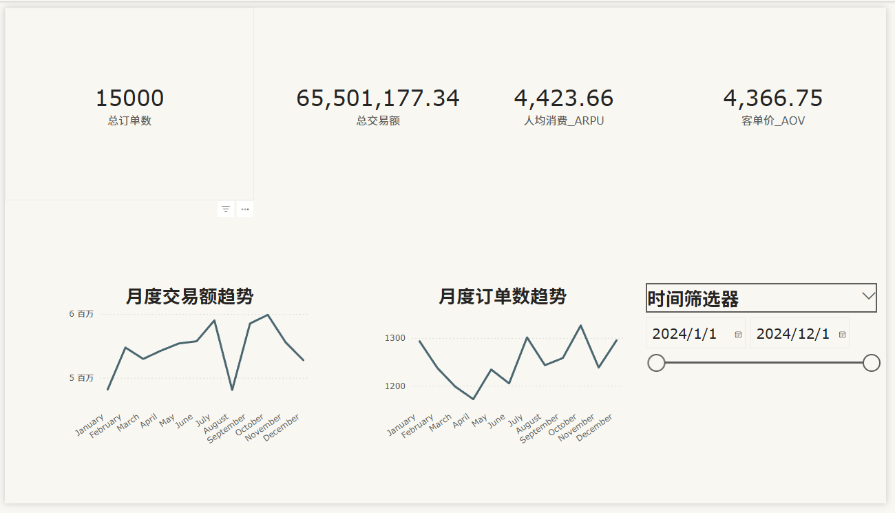
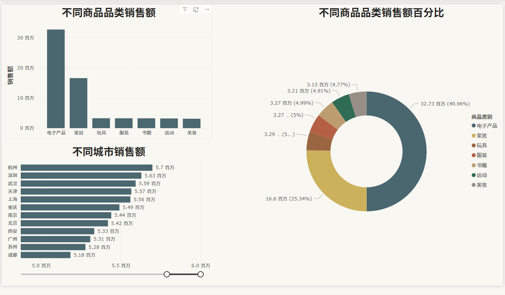
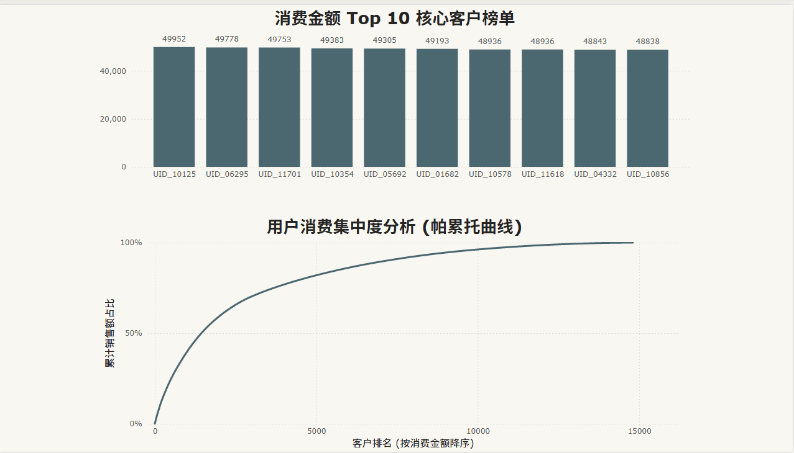
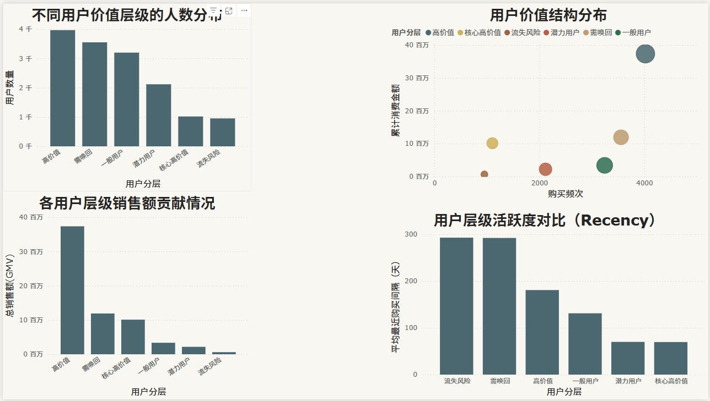

# E-Commerce User Behavior Analysis  

## 1. Business Background  

In e-commerce operations, understanding customer purchasing behavior is critical for improving sales performance and optimizing product strategy.  

This project analyzes transaction-level data to reconstruct user behavior patterns and generate business-oriented insights through Python, SQL, and Power BI.

The dataset includes user ID, product category, purchase time, quantity, and price information.

---

## 2. Problem Statement  

The raw dataset required structured transformation before meaningful business analysis could be conducted.  

Key challenges included:  

- Inconsistent user–order relationships  
- Transaction-level data not directly suitable for KPI construction  
- Lack of structured customer-level metrics  

The objective of this project was to rebuild a clean analytical dataset and extract actionable business insights.

---

## 3. Analytical Approach  

### Step 1 – Data Cleaning (Python / pandas)

- Standardized column names  
- Converted date formats  
- Removed duplicates  
- Validated transaction logic  
- Ensured consistent data types  

### Step 2 – User–Order Relationship Reconstruction  

The dataset was reorganized to ensure a realistic one-to-many relationship between users and orders.  

This restructuring enabled accurate calculation of customer-level KPIs such as purchase frequency and average order value.

### Step 3 – KPI Construction  

Key performance indicators include:

- GMV (Gross Merchandise Value)  
- Average Order Value (AOV)  
- Purchase Frequency  
- Category-level Revenue Contribution  
- Sales Trend Over Time  

### Step 4 – SQL Analysis  

SQL queries were used to:

- Aggregate user-level metrics  
- Analyze product category performance  
- Identify high-value customer segments  

### Step 5 – Power BI Dashboard  

An interactive dashboard was built to visualize:

- KPI Overview  
- Sales Trends  
- Category Performance  
- User Purchasing Behavior  

Dashboard files are available in the `powerbi/` folder.

---

## 4. Key Insights  

- Sales trends show clear temporal variation across periods  
- Certain product categories contribute disproportionately to total revenue  
- High-frequency users generate significantly higher GMV  
- Customer-level metrics provide more strategic insights than transaction-level summaries  

---

## 5. Tech Stack  

- Python (pandas, numpy)  
- SQL  
- Power BI  
- Data Visualization  

---

## 6. Project Structure  
ecommerce-user-behavior-analysis
│
├── data/
├── notebooks/
├── sql/
├── powerbi/
└── images/

---

## 7. Skills Demonstrated  

- End-to-end data analysis workflow  
- Business-oriented KPI design  
- Data restructuring and modeling  
- SQL aggregation and analytical queries  
- Dashboard storytelling and visualization  

---

## 8. Dashboard Preview

### KPI Overview

---

### Sales Trend Analysis

---

### Category Performance

---

### User Segmentation Analysis

